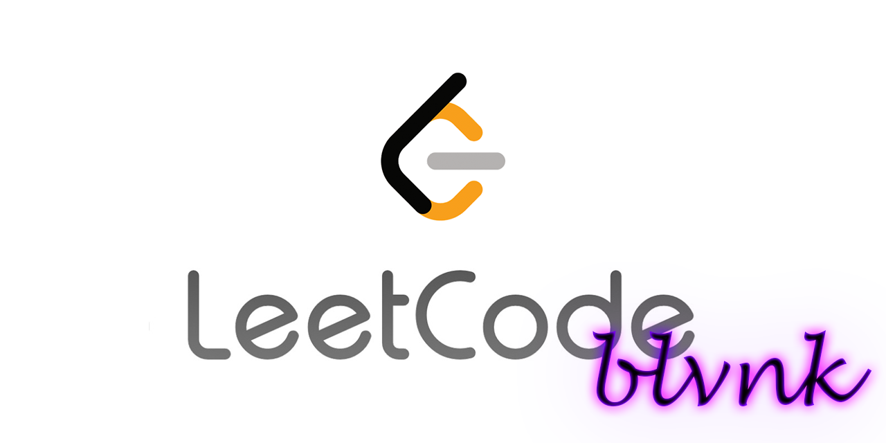

# Code Solutions & DSA Cheat Sheet

Compilation of code solutions for LeetCode & Codewars & [DSA Cheat Sheet](DSA_concepts.md).

prod by blvnk.

## LeetCode

Each challenge is comprised of `challenge.md` & `solution.py`. Difficulty is marked in `challenge.md`.

## Codewars

[Codewars](codewars.com) Python solutions.

Each [Kata](docs.codewars.com/concepts/kata/) challenge has a folder; solution is in the `.py` file, question is in the markdown file.

Certain answers have multiple solutions. those tagged with `# solution` are the official solutions, as shown above.

## Credits

- blvnk